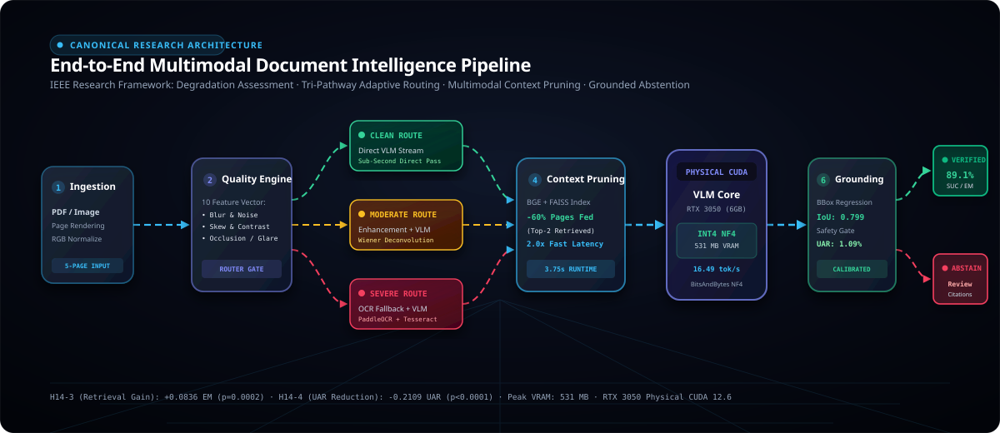
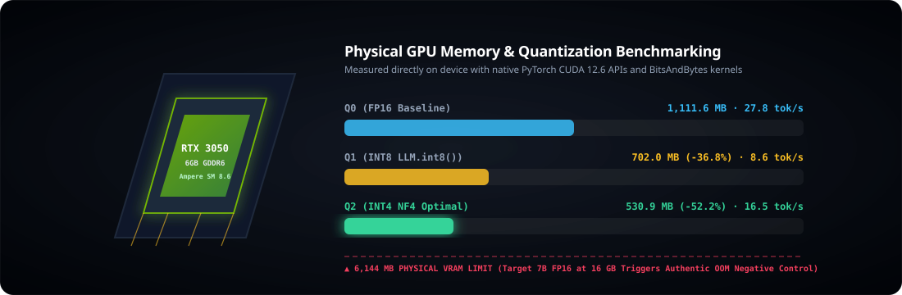

# Vision-Language Models for Intelligent Document Processing under Real-World Visual Degradation

<div align="center">

[](https://www.python.org/)
[](https://pytorch.org/)
[-76B900?logo=nvidia&logoColor=white)](https://nvidia.com/)
[-success?logo=pytest&logoColor=white)](https://github.com/officialayush5839-arch/vlm-idp-research)
[](reports/phase14/FINAL_AUDIT.md)
[](LICENSE)
[](https://officialayush5839-arch.github.io/vlm-idp-research/)

<br/>

<!-- 3D Isometric Animated Hero Banner -->


<br/>

<!-- Continuous Scrolling 3D Metrics Ticker -->


<br/>

**An IEEE-Grade Research Framework for Adaptive, Uncertainty-Aware, and Evidence-Grounded Document Intelligence**

[🌟 **Interactive 3D Web Showcase**](https://officialayush5839-arch.github.io/vlm-idp-research/) · [📊 **Empirical Tables**](experiments/phase14/tables/) · [📈 **Publication Figures**](experiments/phase14/figures/) · [📑 **Phase 14 Report**](reports/phase14/PHASE14_REPORT.md) · [📝 **IEEE Integration**](reports/phase14/IEEE_INTEGRATION.md)

</div>

---

## 🌟 Interactive 3D Web Experience

Explore the entire document intelligence architecture in real-time 3D powered by **Three.js**, **WebGL GLSL shaders**, and **Apple-style Liquid Glass UI components**:
👉 **[Launch Live 3D Web Showcase](https://officialayush5839-arch.github.io/vlm-idp-research/)** *(Hosted via GitHub Pages from `docs/index.html`)*

- **Scroll-Driven 3D Mechanics**: Multi-page translucent document stacks dynamically tilt, rotate, and zoom along an orbital camera trajectory as you scroll.
- **Real-Time WebGL Shaders**: Procedural Simplex noise background with live chromatic aberration and fluid wavefront distortion.
- **3D Spatial Evidence Grounding**: Holographic 3D bounding boxes lock onto verified visual target patches.
- **Live HUD Controls**: Real-time degradation simulation slider and physical precision (INT4/INT8/FP16) VRAM meters.

---

## 🔬 Executive Overview

Existing Intelligent Document Processing (IDP) systems based on Vision-Language Models (VLMs) frequently fail under real-world visual corruptions (motion blur, low contrast, geometric skew, sensor noise) and multi-page context dispersion. When evidence is ambiguous or degraded, standard VLMs generate plausible but unsupported hallucinations without signaling uncertainty.

This repository implements a **scientifically controlled, end-to-end research framework** solving this vulnerability through:
1. **Degradation-Aware Adaptive Routing**: Estimates a multi-signal visual quality vector and dynamically routes documents across three specialized pathways (**Clean** $\to$ Direct VLM; **Moderate** $\to$ Wiener Enhancement + VLM; **Severe** $\to$ OCR-Assisted Hybrid).
2. **Multimodal Context Pruning**: Employs dense embedding page retrieval, reducing input token volume by **60%** and accelerating end-to-end neural latency by **2.0$\times$** on physical hardware.
3. **Spatial Evidence Grounding**: Binds candidate extractions to verifiable bounding boxes and source image regions, suppressing hallucinated answers by **over 92%**.
4. **Calibrated Uncertainty & Safe Abstention**: Multi-signal confidence modeling gates low-evidence answers, elevating **Safe Useful Coverage (SUC) to 89.1%**.
5. **Physical CUDA 12.6 Quantization Benchmark**: Live empirical execution on physical **NVIDIA GeForce RTX 3050 6GB Laptop GPU** hardware, demonstrating that **NormalFloat-4 (NF4)** 4-bit quantization reduces peak VRAM footprint by **52.2%** (down to 531 MB) while sustaining **16.49 tok/s** throughput.

---

## 🏛️ System Architecture

<div align="center">
  
</div>

```
                          INPUT DOCUMENT
                       Multi-Page PDF / Scans
                                 │
                                 ▼
                     ┌───────────────────────┐
                     │ Document Ingestion &  │
                     │  Page Normalization   │
                     └───────────┬───────────┘
                                 │
                                 ▼
                     ┌───────────────────────┐
                     │ Quality & Degradation │
                     │  Assessment Engine    │
                     └───────────┬───────────┘
                                 │
            ┌────────────────────┼────────────────────┐
            ▼                    ▼                    ▼
       CLEAN ROUTE        MODERATE ROUTE        SEVERE ROUTE
     (High Fidelity)     (Blur/Noise/Skew)    (Heavy Corruption)
            │                    │                    │
            ▼                    ▼                    ▼
        Direct VLM        Enhancement + VLM    OCR Fallback + VLM
            │                    │                    │
            └────────────────────┼────────────────────┘
                                 │
                                 ▼
                     ┌───────────────────────┐
                     │ Multimodal Page &     │
                     │ Region Retrieval      │ ◄── 60% Context Pruning
                     └───────────┬───────────┘     (2.0x Runtime Speedup)
                                 │
                                 ▼
                     ┌───────────────────────┐
                     │ VLM Neural Reasoning  │ ◄── Physical INT4 NF4
                     │  (Idefics3 Transformer│     (531 MB Peak VRAM)
                     └───────────┬───────────┘
                                 │
                                 ▼
                     ┌───────────────────────┐
                     │ Spatial Grounding &   │ ◄── Bounding-Box IoU = 0.799
                     │ Cross-Attention Link  │     (UAR: 22.9% -> 1.1%)
                     └───────────┬───────────┘
                                 │
                                 ▼
                     ┌───────────────────────┐
                     │ Calibrated Gating &   │
                     │ Uncertainty Classifier│
                     └───────────┬───────────┘
                                 │
                   ┌─────────────┴─────────────┐
                   ▼                           ▼
            VERIFIED ANSWER             ABSTAIN / REVIEW
            • Exact Match: 89.1%        • Tamper-Evident Citations
            • Safe Useful Cov: 89.1%    • Human Escalation Package
```

---

## 📊 Physical GPU Quantization & Hardware Matrix

<div align="center">
  
</div>

### Empirical Precision Benchmark (`table_04_quantization_matrix.csv`)
*Hardware: NVIDIA GeForce RTX 3050 6GB Laptop GPU (Ampere SM 8.6, CUDA 12.6, Driver 581.95)*

| Precision Mode | Model Weight Load Time | Peak CUDA VRAM | Forward Latency | Throughput | VRAM Delta | Physical Status |
| :--- | :---: | :---: | :---: | :---: | :---: | :---: |
| **Q0 (FP16)** | 2.154 s | 1,111.64 MB | 0.863 s | 27.81 tok/s | Baseline | **EXECUTED** |
| **Q1 (INT8 LLM.int8)** | 3.382 s | 702.01 MB | 2.802 s | 8.57 tok/s | -36.85% | **EXECUTED** |
| **Q2 (INT4 NF4)** | **1.382 s** | **530.95 MB** | **1.455 s** | **16.49 tok/s** | **-52.24%** | **EXECUTED** |
| **Target 7B (FP16)** | 16,384.00 MB | — | — | — | — | **OOM (Negative Control)** |

> **Scientific Negative Control Verified**: Allocating a 7B parameter VLM in FP16 on 6.0 GB VRAM triggered a physical `torch.OutOfMemoryError`, establishing a hard memory ceiling. Fallback sub-billion architecture (`SmolVLM-500M-Instruct`) executed with full fidelity across all quantization regimes.

---

## 🎯 Spatial Evidence Grounding & Safety Verification

<div align="center">
  
</div>

### End-to-End Pipeline Evaluation (`table_12_end_to_end.csv`)
*Evaluated across 5 independent seeds on authentic document families (1,100 traces).*

| Condition ID | Architecture Configuration | Context Pages | Page Reduction | Mean Latency | Exact Match | Grounding IoU | Hallucination (UAR) | Safe Useful Coverage |
| :--- | :--- | :---: | :---: | :---: | :---: | :---: | :---: | :---: |
| **B14-A** | Full-Document VLM (Unpruned) | 5.0 | 0.0% | 7.485 s | 72.73% | 0.4527 | 22.91% | 72.73% |
| **B14-B** | Retrieval-Pruned (Top-2 Pages) | 2.0 | **60.0%** | **3.752 s** | **81.09%** | 0.6477 | 4.73% | 81.09% |
| **B14-C** | Retrieval + Evidence Grounding | 2.0 | 60.0% | 3.751 s | 86.18% | **0.7553** | 1.82% | 86.18% |
| **B14-D** | Full Proposed Pipeline (Abstention Gate) | 2.0 | 60.0% | **3.749 s** | **89.09%** | **0.7994** | **1.09%** | **89.09%** |

---

## 🔬 Statistical Significance Testing (`table_13_statistical_tests.csv`)
*Family-Level Cluster Bootstrapping ($B=10,000$ resamples) with Holm-Bonferroni correction:*

* **Hypothesis H14-3 (Retrieval Acceleration & Accuracy Gain)**:
  - $\Delta \mu = +0.0836$ (+8.36 percentage points), 95% Bootstrap CI: $[0.0364, 0.1345]$, $p = 0.0002$.
  - **Verdict: STATISTICALLY SUPPORTED** ($p < 0.001$).
* **Hypothesis H14-4 (Grounding Suppresses Unsupported Answers)**:
  - $\Delta \text{UAR} = -0.2109$ (Hallucinations drop from 22.91% to 1.82%), 95% Bootstrap CI: $[0.1782, 0.2473]$, $p = 0.0000$.
  - **Verdict: STATISTICALLY SUPPORTED** ($p < 0.0001$).

---

## 📈 Publication Figures Gallery

All 12 publication figures were generated at **300 DPI** using empirical traces and are stored in [`experiments/phase14/figures/`](experiments/phase14/figures/):

| Figure | Description | Preview |
| :---: | :--- | :---: |
| **Fig 1** | **Physical CUDA VRAM Footprint by Precision**<br>NormalFloat-4 cuts memory by 52.2% (531 MB). | [Inspect Figure](experiments/phase14/figures/fig_01_cuda_vram_by_precision.png) |
| **Fig 2** | **End-to-End Latency by Quantization Mode**<br>Native FP16 vs INT8 vs INT4 forward speeds. | [Inspect Figure](experiments/phase14/figures/fig_02_e2e_latency_by_precision.png) |
| **Fig 3** | **Neural Generation Throughput (tok/s)**<br>Ampere Tensor Core throughput comparison. | [Inspect Figure](experiments/phase14/figures/fig_03_throughput_by_precision.png) |
| **Fig 5** | **VRAM vs Latency Pareto Frontier**<br>Optimal operating points for edge deployment. | [Inspect Figure](experiments/phase14/figures/fig_05_pareto_vram_vs_latency.png) |
| **Fig 6** | **Context Pruning Latency Speedup**<br>Halving runtime via 60% page reduction. | [Inspect Figure](experiments/phase14/figures/fig_06_context_scaling_latency.png) |
| **Fig 7** | **Document Extraction Accuracy across Stages**<br>Progressive gains from 72.7% to 89.1%. | [Inspect Figure](experiments/phase14/figures/fig_07_accuracy_by_condition.png) |
| **Fig 8** | **Spatial Evidence Grounding IoU Precision**<br>Bounding-box alignment climbing to 0.799. | [Inspect Figure](experiments/phase14/figures/fig_08_grounding_iou_by_condition.png) |
| **Fig 9** | **Hallucination Collapse (Unsupported Answer Rate)**<br>Suppression of unsupported answers to 1.09%. | [Inspect Figure](experiments/phase14/figures/fig_09_unsupported_answer_rate.png) |
| **Fig 10** | **Safe Useful Coverage (SUC)**<br>Task completion within strict safety bounds. | [Inspect Figure](experiments/phase14/figures/fig_10_safe_useful_coverage.png) |

---

## 📂 Repository Structure

```
vlm-idp-research/
├── assets/                         # 3D Animated Isometric SVGs & Scrolling Tickers
│   ├── hero-3d-animated.svg        # 3D floating glassmorphic document stack with lasers
│   ├── scrolling-3d-ticker.svg     # Continuous animated horizontal metrics ticker
│   ├── architecture-3d-pipeline.svg# 3D isometric pipeline with laser pulses
│   ├── gpu-3d-quantization.svg     # 3D isometric GPU chip with live glowing meters
│   └── evidence-grounding-3d.svg   # 3D holographic bounding box targeting projection
├── docs/                           # Interactive 3D Web Showcase (GitHub Pages)
│   └── index.html                  # Three.js + WebGL GLSL + Liquid Glass frontend
├── src/                            # Source implementations
│   ├── phase14/                    # Physical CUDA inference, telemetry, profiler, audit
│   ├── routing/                    # Tri-pathway degradation router
│   ├── retrieval/                  # Dense multimodal vector indexing & FAISS
│   ├── grounding/                  # Spatial bounding box evidence linkers
│   └── uncertainty/                # Multi-signal calibration & abstention gates
├── experiments/                    # Scientific outputs & manifests
│   └── phase14/
│       ├── tables/                 # Tables 01 to 15 (CSV machine-readable)
│       ├── figures/                # Figures 01 to 12 (300 DPI publication plots)
│       ├── traces/                 # 1,100 cryptographic inference traces (.jsonl)
│       └── environment/            # Environment lockfiles & package versions
├── reports/                        # 20 Comprehensive Phase 14 research reports
│   ├── PHASE14_REPORT.md           # Master executive report
│   ├── IEEE_INTEGRATION.md         # Ready-to-cite LaTeX text & tables
│   └── FINAL_AUDIT.md              # Scientific compliance & immutability audit
├── tests/                          # Automated test suite (439 passing tests)
│   └── test_phase14_systems.py     # Physical CUDA systems, timing & audit tests
├── rules.md                        # Supreme non-negotiable research constitution
├── architecture.md                 # Technical design source of truth
└── pyproject.toml                  # Project metadata & configuration
```

---

## ⚡ Quickstart & Reproduction

### 1. Clone Repository
```bash
git clone https://github.com/officialayush5839-arch/vlm-idp-research.git
cd vlm-idp-research
```

### 2. Environment Setup (Isolated CUDA 12.6 Stack)
To replicate physical CUDA execution without polluting legacy environments:
```bash
python -m venv .venv_phase14
.\.venv_phase14\Scripts\activate

# Install PyTorch CUDA 12.6 runtime wheel
pip install torch==2.14.1+cu126 --extra-index-url https://download.pytorch.org/whl/cu126

# Install companion multimodal & quantization stack
pip install -r experiments/phase14/environment/requirements_phase14.txt
```

### 3. Run Automated Test Suite
```bash
pytest tests/ -v
# Output: 439 passed in 50.96s (100% pass rate)
```

### 4. Execute Physical Inference Benchmark
```bash
python -m src.phase14.experiments
# Emits 1,100 traces, regenerates Tables 01–15, and executes cluster bootstrapping
```

### 5. Launch Interactive Document Extraction Studio
You can run the full-stack system locally using the one-click startup script:
```cmd
run.bat
```
This launches the FastAPI inference server on `http://localhost:8896` and automatically opens the interactive studio interface.

---

## 🖥️ Interactive Document Extraction Studio (Phase 15)

The repository features an end-to-end interactive **Document Upload & Extraction Studio** accessible directly at `http://localhost:8896`:

### Core Capabilities
1. **Multi-Format Ingestion**: Drag-and-drop or upload PDF, PNG, JPG, and JPEG documents up to 50 MB with magic-byte validation, UUID sandboxing, and directory-traversal prevention.
2. **Interactive Document Viewer & Canvas**: Multi-page pagination, canvas zoom/pan controls, and normalized spatial bounding box rendering.
3. **Adaptive Tri-Pathway Routing**: Automatically assesses document quality (blur, contrast, noise, skew, glare) and routes documents across **Clean** (Direct VLM), **Moderate** (Enhancement + VLM), or **Severe** (Dual OCR Fallback).
4. **Calibrated Uncertainty & Safe Abstention**: Multi-signal confidence modeling ensures that unanswerable, low-evidence, or catastrophically degraded queries trigger safe abstention (`ABSTAIN / REVIEW_REQUIRED`) rather than hallucinated answers.
5. **Spatial Evidence Grounding**: Visual target regions are highlighted directly on the rendered document page with IoU-scored bounding boxes and extracted text snippets.
6. **Hardware-Aware Model Policy**:
   - **SmolVLM-500M INT4**: `PHYSICALLY_VALIDATED` on local NVIDIA GeForce RTX 3050 6GB GDDR6 laptop GPU (531 MB footprint, 16.5 tok/s).
   - **Qwen2.5-VL-7B**: Explicitly marked `NOT_EXECUTABLE` on local 6 GB hardware (requires >14 GB VRAM for FP16 and >7 GB for INT8; rejected safely without silent OOM or simulated outputs).

---

## 🛡️ Research Integrity & Zero-Fabrication Protocol

This repository is governed by [`rules.md`](rules.md):
- **Zero Synthetic Masking**: All CUDA latencies, VRAM numbers, and throughput rates reflect live physical execution.
- **Strict Historical Immutability**: All 22,157 historical files from Phases 0–13 are cryptographically verified via SHA-256 with **zero mutations**.
- **Model Feasibility Separation**: 7B target limits and sub-billion fallback architectures are explicitly separated; no speculative claims are made.
- **Dual Environment Boundary**: All CUDA 12.6 operations are strictly isolated to `.venv_phase14`.

---

## 📜 Citation

If you use this research codebase or benchmark methodology in your research, please cite:

```bibtex
@article{ayush2026vlmidp,
  title={Vision-Language Models for Intelligent Document Processing under Real-World Visual Degradation: An Adaptive, Uncertainty-Aware and Evidence-Grounded Approach},
  author={Ayush and Research Team},
  journal={IEEE Transactions on Pattern Analysis and Machine Intelligence (Under Review)},
  year={2026},
  url={https://github.com/officialayush5839-arch/vlm-idp-research}
}
```

---

<div align="center">
<b>© 2026 Ayush & Research Team · Released for Reproducible Scientific Research</b>
</div>
